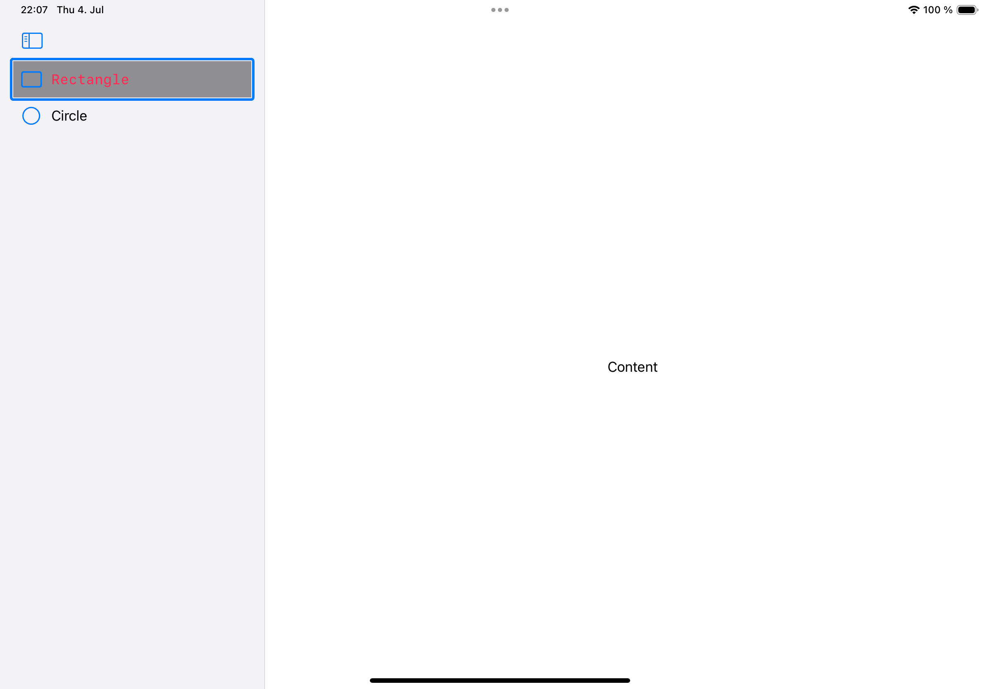

#  FB - SwiftUI: Sidebar List should provide a way to set the background color of the selected element.

## Scenario

A SwiftUI app showing a sidebar, either in NavigationSplitView or TabView. 

## Issue

There is no way to set the color of the background of a selected item in the sidebar. Setting .listRowBackground() does not affect the visual highlight, but colors the complete row and shows a border on selection.

	
## Example code

The example shows a NavigationSplitView setting .listRowBackground() for one of the sidebar rows.

  

## Suggestion

In list style .sidebar the .listRowBackground() should only affect the selected cell and be limited to the selection shape.

## Tested on

	- Xcode Version 16.0 beta 2 (16A5171r)

